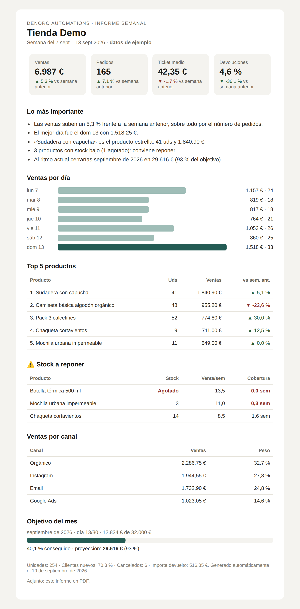

# Weekly Store Report

**Denoro Automations** · Every Monday at 8:00 the store owner gets a clear report of last week by email (with a **PDF** attached) and a short summary on Telegram. No dashboards to open.



## What the report includes
- **Sales, orders, average order value and refund rate**, each compared with the week before
- **Key takeaways** written automatically (what drove the change, best day, star product…)
- **Sales per day** chart and **top 5 products** with their trend
- ⚠️ **Stock to reorder**: products at or below the minimum, or that will run out in less than *N* weeks at the current sales pace
- **Sales by channel** (Shopify source / WooCommerce order attribution)
- **Monthly goal**: progress and month-end projection

## Data sources
Set `fuente` in the *Configuración* node:

| `fuente` | What it uses |
|---|---|
| `demo` | 10 weeks of realistic sample orders (default, works out of the box) |
| `shopify` | Shopify nodes: orders from the last weeks + products with tracked inventory |
| `woocommerce` | WooCommerce nodes: orders + products with managed stock |

Everything is converted to one common format, so the KPIs and the report are the same for every store.

## Setup (n8n)
1. **Import from File** → `n8n-workflow.json` and `n8n-error-workflow.json`.
2. Edit the **CONFIGURATION** block: store name, source, currency, time zone, minimum stock, monthly goal and recipients (`email_to`, `email_from`, `telegram_chat_id`). Example values stop the workflow with a clear message; an empty value turns that channel off.
3. If you use Shopify or WooCommerce, pick the credential in their two nodes.
4. Pick credentials in **Enviar email** (SMTP) and **Enviar PDF a Telegram**.
5. **PDF:** start [Gotenberg](https://gotenberg.dev) next to n8n:
   ```bash
   docker run -d --name gotenberg --restart unless-stopped -p 3000:3000 gotenberg/gotenberg:8
   ```
   The workflow uses `http://host.docker.internal:3000` (Docker Desktop). If n8n and Gotenberg share a Docker network, use `http://gotenberg:3000`. **If Gotenberg is not available, the report is still sent, with the HTML file attached instead of the PDF.**
6. *Settings → Error workflow* → **Denoro — Avisos de error**, then activate.

## Quality
- The JavaScript for every Code node lives in `n8n/src/` and is tested outside n8n: `node n8n/test/test_weekly_report.js` (demo data, Shopify and WooCommerce mapping, KPI maths, stock alerts, PDF fallback, empty store).
- `python n8n/build.py` rebuilds the workflow JSON from the sources.
- Tested on a real n8n instance.

## Possible extensions (not included, quoted separately)
Daily Telegram summary · real-time low-stock alerts · Google Sheets export · targets per product line.

Want it for your store? It is included in the Premium plan of the price monitor, or on its own with a fixed quote: [https://denoroautomations.com/](https://denoroautomations.com/).
